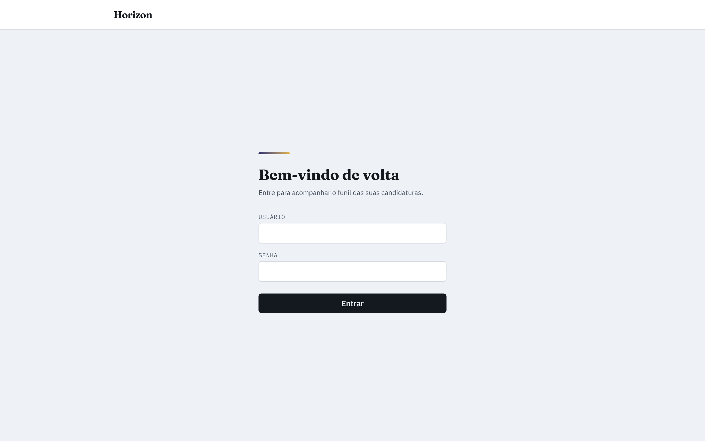
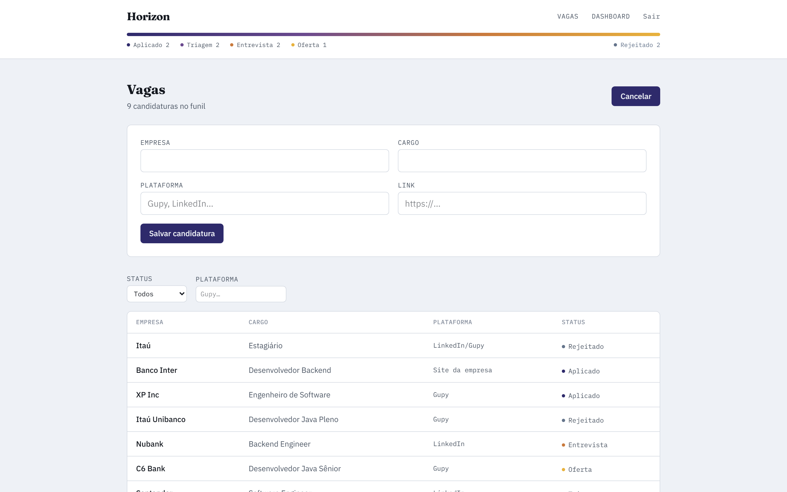
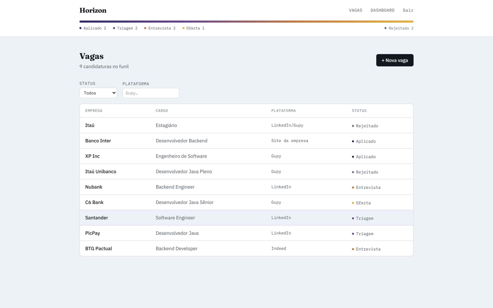
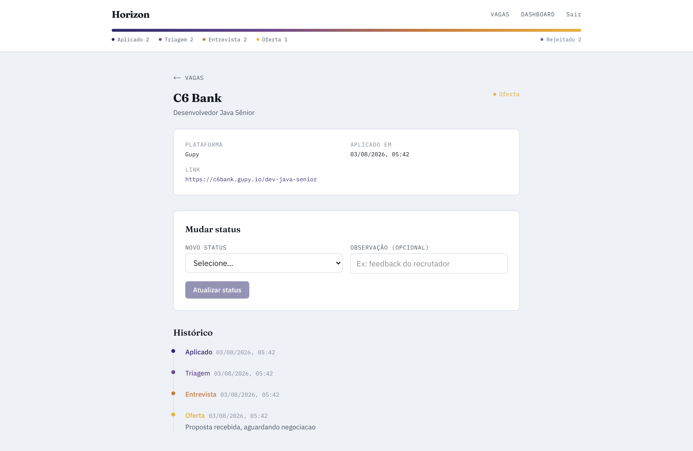
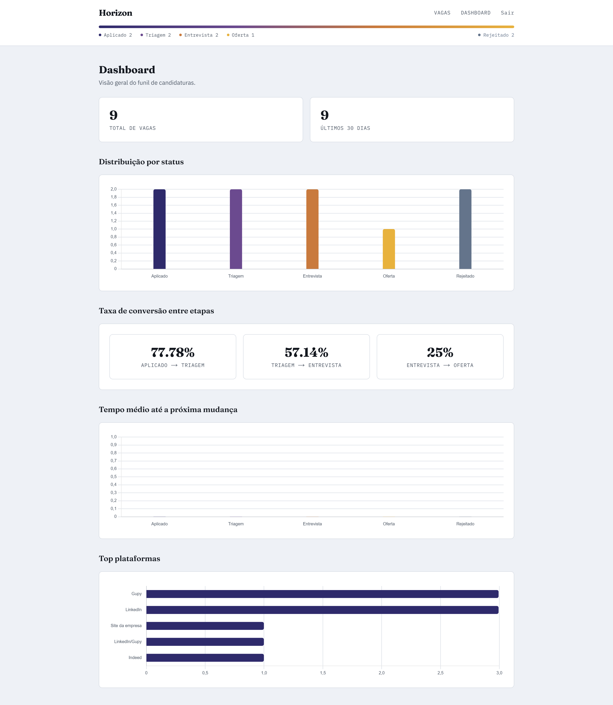

# Horizon

[](backend/pom.xml)
[](backend/pom.xml)
[](frontend/package.json)
[](frontend/package.json)
[](frontend/package.json)
[](docker-compose.yml)
[](docker-compose.yml)

Rastreador de candidaturas a vagas dev, com histórico de status por vaga e um dashboard de métricas sobre o funil de candidatura (aplicado → triagem → entrevista → oferta/rejeitado).

Projeto de portfólio (Java/Spring Boot + Next.js) que também serve como ferramenta pessoal para o processo real de busca de vaga.

## Índice

- [Funcionalidades](#funcionalidades)
- [Screenshots](#screenshots)
- [Stack](#stack)
- [Como rodar (backend)](#como-rodar-backend)
- [Como rodar (frontend)](#como-rodar-frontend)
- [Páginas](#páginas)
- [Documentação](#documentação)
- [Status](#status)

## Funcionalidades

- CRUD completo de vaga (criar, listar com filtros, ver detalhe, arquivar).
- Histórico de status como tabela de eventos (não um campo mutável) — cada mudança de status vira um registro com timestamp e observação opcional.
- Mudança de status livre, sem máquina de estado — reflete o funil real, onde uma vaga pode voltar de "Entrevista" para "Triagem" ou ir de qualquer status direto para "Rejeitado".
- Dashboard com 5 métricas: total de vagas, distribuição por status, taxa de conversão entre etapas, tempo médio por etapa e top plataformas — todas calculadas a partir do histórico real, não de contadores redundantes.
- Autenticação JWT com usuário único (uso pessoal, sem necessidade de multi-usuário na v1).

## Screenshots

<table>
<tr>
<td width="50%">

**Login**



</td>
<td width="50%">

**Nova candidatura**



</td>
</tr>
<tr>
<td width="50%">

**Listagem de vagas**



</td>
<td width="50%">

**Detalhe + histórico de status**



</td>
</tr>
</table>

**Dashboard**



## Stack

- **Backend:** Java 21 + Spring Boot (Spring Security/JWT, JPA/Hibernate, PostgreSQL, springdoc-openapi/Swagger UI).
- **Frontend:** Next.js (App Router) + TypeScript + Tailwind CSS v4.
- **Gráficos:** Chart.js.
- **Infra:** Docker Compose (API + PostgreSQL).

## Como rodar (backend)

```bash
cp .env.example .env   # ajuste DB_PASSWORD, JWT_SECRET, ADMIN_USERNAME e ADMIN_PASSWORD_HASH

# Sobe API + PostgreSQL em containers
docker compose up --build

# OU, rodando a API local (perfil `local`) contra o Postgres do compose:
docker compose up postgres -d
cd backend && ./mvnw spring-boot:run
```

API disponível em `http://localhost:8081` (porta configurável via `APP_PORT` no `.env`; rodando local via `mvnw`, é `8080`).

### Gerar o hash de `ADMIN_PASSWORD_HASH`

`ADMIN_PASSWORD_HASH` é um hash BCrypt — nunca a senha em texto puro. Gere um com `jshell` usando os jars já baixados pelo Maven (rode `./mvnw compile` no `backend/` primeiro para garantir que estão no `~/.m2`):

```bash
CP="$(find ~/.m2 -iname 'spring-security-crypto-*.jar' ! -iname '*sources*' | head -1):$(find ~/.m2 -iname 'commons-logging-*.jar' | head -1):$(find ~/.m2 -iname 'spring-core-*.jar' ! -iname '*sources*' | head -1)"
echo 'System.out.println(new org.springframework.security.crypto.bcrypt.BCryptPasswordEncoder().encode("SUA_SENHA"))' | jshell --class-path "$CP" -q -
```

Cole o resultado (começa com `$2a$10$...`) em `ADMIN_PASSWORD_HASH` no `.env` — **escapando todo `$` como `$$`** (ex: `$2a$10$abc...` vira `$$2a$$10$$abc...`). O `docker compose` interpola `$` no `.env` como variável; sem escapar, o hash chega corrompido no container e o login falha silenciosamente com credenciais "erradas".

### Login

```bash
curl -X POST http://localhost:8081/api/v1/auth/login \
  -H "Content-Type: application/json" \
  -d '{"username":"admin","password":"SUA_SENHA"}'
```

Retorna `{"token": "..."}` — envie em `Authorization: Bearer <token>` nas chamadas a `/api/v1/vagas/**` e `/api/v1/dashboard/**`.

### Swagger UI

Com a API rodando: `http://localhost:8081/swagger-ui/index.html` (`/v3/api-docs` para o JSON do OpenAPI). Use o botão **Authorize** para colar o token do login e testar os endpoints protegidos direto pela UI.

## Como rodar (frontend)

Com a API já rodando (via `docker compose` ou `mvnw`, acima):

```bash
cd frontend
cp .env.example .env.local   # NEXT_PUBLIC_API_URL, default http://localhost:8081
npm install
npm run dev
```

Abre em `http://localhost:3000` — redireciona para `/login` sem token válido. Detalhes da estrutura em [frontend/README.md](frontend/README.md).

## Páginas

- `/login` — autenticação (usuário único).
- `/vagas` — listagem com filtros por status/plataforma + criação de candidatura.
- `/vagas/[id]` — detalhe, histórico completo e mudança de status.
- `/dashboard` — as 5 métricas do funil (seção 6 do PRD) com gráficos Chart.js.

## Documentação

- [PRD](docs/prd.md) — visão de produto, escopo da v1, modelo de domínio, métricas.
- [Arquitetura](docs/arquitetura.md) — decisões técnicas, contrato da API, estrutura de pastas.
- [decisions.md](decisions.md) — histórico completo de decisões técnicas (ação/motivo/trade-off), issue por issue.

## Status

v1 (MVP) completa — CRUD de vaga ponta a ponta com histórico de status, dashboard com as 5 métricas do PRD, autenticação JWT, frontend Next.js. Acompanhe o histórico nas [issues fechadas](../../issues?q=is%3Aissue+is%3Aclosed).

Fora de escopo por decisão deliberada (v2+): parsing automático de vaga, integração com e-mail, lembretes automáticos, multi-usuário — ver seção 3 do [PRD](docs/prd.md).
